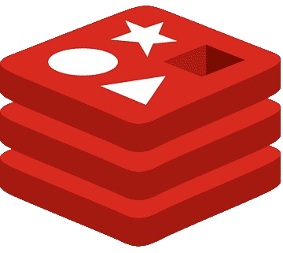
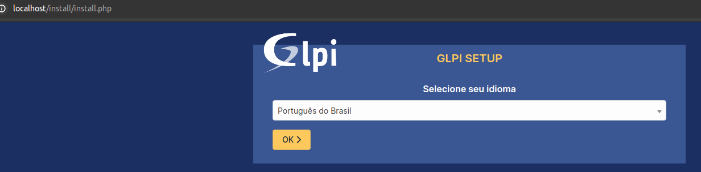
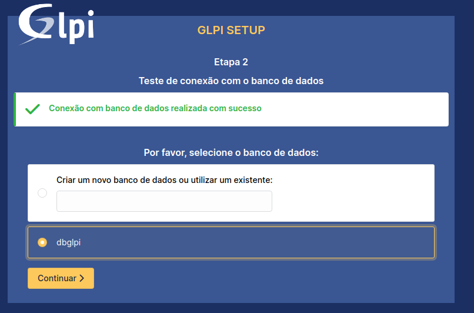
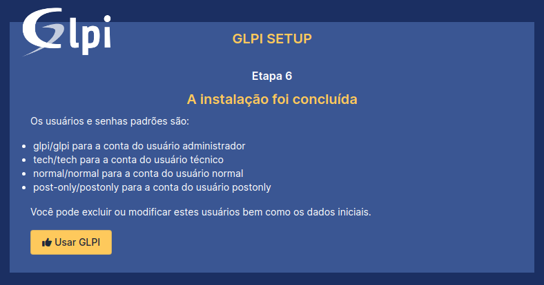
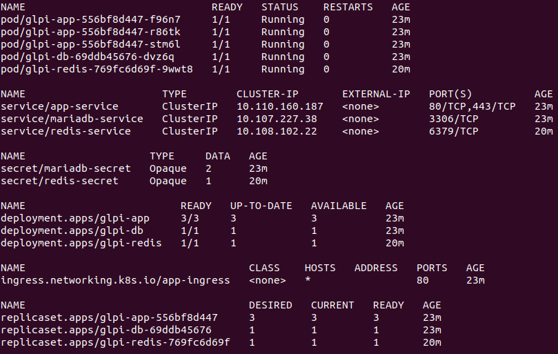

# Deploy do GLPI com Nginx, MariaDB e Redis

<p align="center">
  <span style="margin: 10px;"></span>
  <span style="margin: 10px;"></span>
  <span style="margin: 10px;"></span>
  <span style="margin: 10px;"></span>
</p>


## Stack
- Debian / Ubuntu
- Docker v26.1.1
- Docker Compose v1.29.2

## Como usar
1. Clone o repositório e acesse a pasta do projeto
```bash
git clone https://github.com/oneabrante/Deploy_GLPI.git ; cd Deploy_GLPI
```
2. Instale os pré-requisitos (pule caso possuir estas ferramentas)
```bash
chmod +x requirements.sh
./requirements.sh
```
3. Inicie os containers a partir do arquivo `docker-compose.yml` com o comando:
```bash
docker-compose up -d
```
Nesse momento são criados ao todo 4 containers: glpi, phpmyadmin, mariadb e redis. O container do phpmyadmin foi criados para uma complementação de serviços à parte, assim como também o trecho comentado do container OpenSSL que gera certificados ssl.

## Procedimento
- GLPI: http://localhost ou http://ip-do-servidor

<p align="center">
  
</p>

Para configurar o GLPI com o banco de dados MariaDB, siga os passos abaixo:
1. No campo relacionado ao banco de dados, use o nome do container do MariaDB: `mariadb`
2. No campo do usuário, use `glpi`
3. No campo da senha, use `password_glpi`

Com isso, temos que a configuração com o banco de dados esteja concluída. Selecione o nome do banco, conforme a imagem abaixo

<p align="center">
  
</p>

<p align="center">
  
</p>

## Uso do Redis 
Para habilitar o Redis, digite no terminal:
```bash
docker exec glpi php /var/www/html/glpi/bin/console cache:configure --context=core --dsn=redis://redis:6379
```
<hr>

<h1> K8s </h1>

<p align="justify">No diretório k8s, encontram-se os arquivos de configuração (manifest files) para o provisionamento do GLPI através do Kubernetes</p>
<p align="justify">Os recursos necessários foram:</p>

<p align="justify">Para o GLPI:</p>

- Três Pods: Pensando em um cenário de maior disponibilidade e escalabilidade.
- Service: Do tipo ClusterIP, para o fornecimento de conectividade interna entre diferentes recursos do cluster.
- Ingress: Para que o serviço possa ser acessado de fora do cluster.
- ConfigMap: Para armazenar o host do banco de dados.
- Deployment: Para gerenciar a criação e a atualização dos Pods do GLPI.

<p align="justify">Para o MariaDB:</p>

- Um Pod: Para a execução do banco de dados.
- Deployment: Para gerenciar a criação e a atualização do Pod do MariaDB.
- ConfigMap: Para armazenar as variáveis de ambiente necessárias para a configuração do banco de dados.
- Secret: Para armazenar as credenciais de conexão com o banco de dados.
- Service: Do tipo ClusterIP, não sendo necessário o acesso externo.

<p align="justify">Para o Redis:</p>

- Um Pod: Para a execução do Redis.
- Deployment: Para gerenciar a criação e a atualização do Pod do Redis.
- Service: Do tipo ClusterIP, não sendo necessário o acesso externo.
- ConfigMap: Para armazenar as variáveis de ambiente necessárias para a configuração do Redis.
- Secret: Para armazenar as credenciais de conexão com o Redis.

<h3>Pré-requisitos</h3>

- Minikube com o driver do Docker
- Kubectl
- Ingress Controller (Nginx)
- Namespace: dev-glpi

<h3>Como usar</h3>

```bash
# Certifique-se que o Docker está instalado e rodando corretamente.
# Após instalar o Minikube, execute os comandos abaixo:
minikube config set driver docker
minikube start

# Habilite o Ingress Controller (Nginx: por padrão no Minikube)
minikube addons enable ingress
# Crie o namespace dev-glpi
kubectl create ns dev-glpi

# Acesse o diretório raiz do repositório e execute o comando logo em seguida:
cd Deploy_GLPI/
cd k8s/app/ && kubectl apply -f . && cd ../mariadb/ && kubectl apply -f . && cd ../redis/ && kubectl apply -f .

# Verifique se os recursos foram criados
kubectl get pod,svc,secret,deployment,ingress,replicaset -n dev-glpi

# Nesse momento o GLPI fica disponível apenas internamente ao cluster, para acessar externamente, execute o comando abaixo:
kubectl port-forward --address 192.168.0.99 service/app-service 8000:80 8443:443 -n dev-glpi

# Acesse o GLPI através do endereço: http://192.168.0.99:8000
```

<p align="center">
    
    <br>
    <span>watch kubectl get pod,svc,secret,deployment,ingress,replicaset -n dev-glpi</span>
</p>
<br>

<h3>Implementação do Redis</h3>

<p align="justify">Para habilitar o Redis, digite no terminal:</p>

```bash
kubectl exec service/app-service -n dev-glpi -- php /var/www/html/glpi/bin/console cache:configure --context=core --dsn=redis://redis-service:6379
```


## Autor
<br><sub>Thiago Abrante</sub>

## Referências
- [GLPI](https://glpi-project.org/)
- [Nginx](https://www.nginx.com/)
- [MariaDB](https://mariadb.org/)
- [Redis](https://redis.io/)
- [Docker](https://www.docker.com/)
- [Docker Compose](https://docs.docker.com/compose/)


